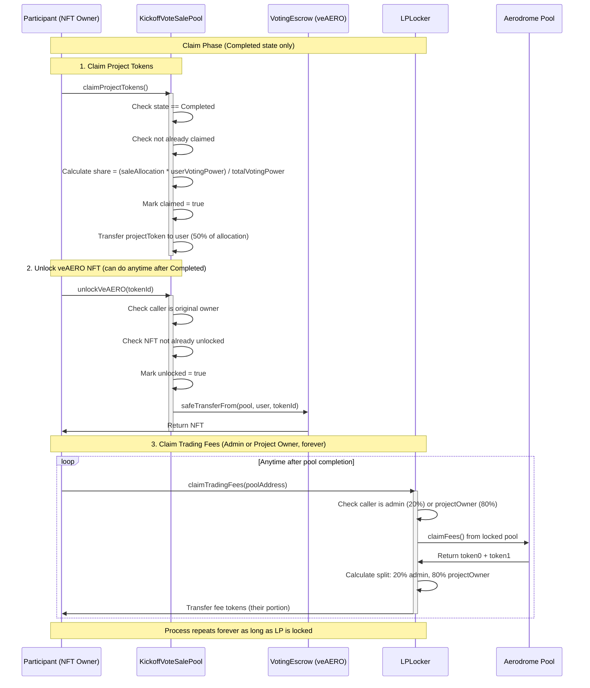

# Claim Phase Flow

```mermaid
sequenceDiagram
    participant User as Participant (NFT Owner)
    participant Pool as KickoffVoteSalePool
    participant VE as VotingEscrow (veAERO)
    participant Locker as LPLocker
    participant Aerodrome as Aerodrome Pool

    Note over User,Locker: Claim Phase (Completed state only)
    
    Note over User,Pool: 1. Claim Project Tokens
    User->>Pool: claimProjectTokens()
    activate Pool
    Pool->>Pool: Check state == Completed
    Pool->>Pool: Check not already claimed
    Pool->>Pool: Calculate share = (saleAllocation * userVotingPower) / totalVotingPower
    Pool->>Pool: Mark claimed = true
    Pool->>Pool: Transfer projectToken to user (50% of allocation)
    deactivate Pool

    Note over User,Pool: 2. Unlock veAERO NFT (can do anytime after Completed)
    User->>Pool: unlockVeAERO(tokenId)
    activate Pool
    Pool->>Pool: Check caller is original owner
    Pool->>Pool: Check NFT not already unlocked
    Pool->>Pool: Mark unlocked = true
    Pool->>VE: safeTransferFrom(pool, user, tokenId)
    VE->>User: Return NFT
    deactivate Pool

    Note over User,Locker: 3. Claim Trading Fees (Admin or Project Owner, forever)
    
    loop Anytime after pool completion
        User->>Locker: claimTradingFees(poolAddress)
        activate Locker
        Locker->>Locker: Check caller is admin (20%) or projectOwner (80%)
        Locker->>Aerodrome: claimFees() from locked pool
        Aerodrome->>Locker: Return token0 + token1
        Locker->>Locker: Calculate split: 20% admin, 80% projectOwner
        Locker->>User: Transfer fee tokens (their portion)
        deactivate Locker
    end

    Note over User,Locker: Process repeats forever as long as LP is locked
```