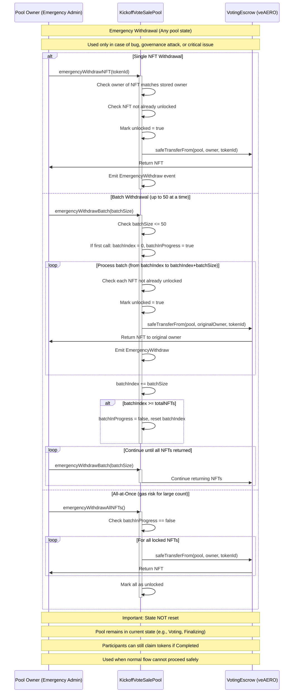

# Emergency Withdrawal Flow

```mermaid
sequenceDiagram
    participant Owner as Pool Owner (Emergency Admin)
    participant Pool as KickoffVoteSalePool
    participant VE as VotingEscrow (veAERO)

    Note over Owner,VE: Emergency Withdrawal (Any pool state)
    Note over Owner,VE: Used only in case of bug, governance attack, or critical issue

    alt Single NFT Withdrawal
        Owner->>Pool: emergencyWithdrawNFT(tokenId)
        activate Pool
        Pool->>Pool: Check owner of NFT matches stored owner
        Pool->>Pool: Check NFT not already unlocked
        Pool->>Pool: Mark unlocked = true
        Pool->>VE: safeTransferFrom(pool, owner, tokenId)
        VE->>Owner: Return NFT
        Pool->>Pool: Emit EmergencyWithdraw event
        deactivate Pool

    else Batch Withdrawal (up to 50 at a time)
        Owner->>Pool: emergencyWithdrawBatch(batchSize)
        activate Pool
        Pool->>Pool: Check batchSize <= 50
        Pool->>Pool: If first call: batchIndex = 0, batchInProgress = true
        
        loop Process batch (from batchIndex to batchIndex+batchSize)
            Pool->>Pool: Check each NFT not already unlocked
            Pool->>Pool: Mark unlocked = true
            Pool->>VE: safeTransferFrom(pool, originalOwner, tokenId)
            VE->>Owner: Return NFT to original owner
            Pool->>Pool: Emit EmergencyWithdraw
        end
        
        Pool->>Pool: batchIndex += batchSize
        alt batchIndex >= totalNFTs
            Pool->>Pool: batchInProgress = false, reset batchIndex
        end
        deactivate Pool
        
        loop Continue until all NFTs returned
            Owner->>Pool: emergencyWithdrawBatch(batchSize)
            activate Pool
            Pool->>VE: Continue returning NFTs
            deactivate Pool
        end

    else All-at-Once (gas risk for large count)
        Owner->>Pool: emergencyWithdrawAllNFTs()
        activate Pool
        Pool->>Pool: Check batchInProgress == false
        
        loop For all locked NFTs
            Pool->>VE: safeTransferFrom(pool, owner, tokenId)
            VE->>Owner: Return NFT
        end
        
        Pool->>Pool: Mark all as unlocked
        deactivate Pool
    end

    Note over Owner,VE: Important: State NOT reset
    Note over Owner,VE: Pool remains in current state (e.g., Voting, Finalizing)
    Note over Owner,VE: Participants can still claim tokens if Completed
    Note over Owner,VE: Used when normal flow cannot proceed safely
```