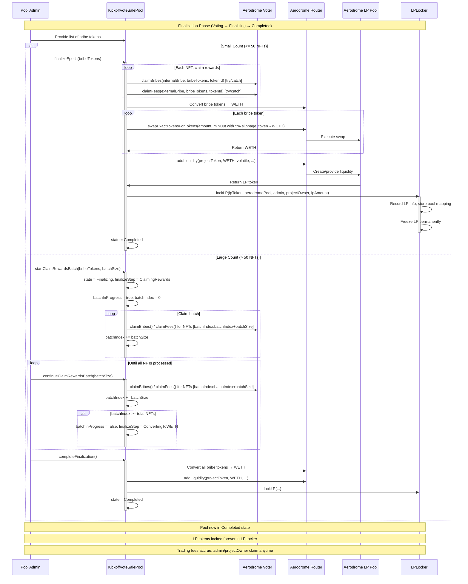

# Finalization Phase Flow

```mermaid
sequenceDiagram
    participant Admin as Pool Admin
    participant Pool as KickoffVoteSalePool
    participant Voter as Aerodrome Voter
    participant Router as Aerodrome Router
    participant LP as Aerodrome LP Pool
    participant Locker as LPLocker

    Note over Admin,Locker: Finalization Phase (Voting → Finalizing → Completed)
    
    Admin->>Pool: Provide list of bribe tokens
    
    alt Small Count (<= 50 NFTs)
        Admin->>Pool: finalizeEpoch(bribeTokens)
        activate Pool
        
        loop Each NFT, claim rewards
            Pool->>Voter: claimBribes(internalBribe, bribeTokens, tokenId) [try/catch]
            Pool->>Voter: claimFees(externalBribe, bribeTokens, tokenId) [try/catch]
        end
        
        Pool->>Router: Convert bribe tokens → WETH
        loop Each bribe token
            Pool->>Router: swapExactTokensForTokens(amount, minOut with 5% slippage, token→WETH)
            Router->>LP: Execute swap
            LP->>Pool: Return WETH
        end
        
        Pool->>Router: addLiquidity(projectToken, WETH, volatile, ...)
        Router->>LP: Create/provide liquidity
        LP->>Pool: Return LP token
        
        Pool->>Locker: lockLP(lpToken, aerodromePool, admin, projectOwner, lpAmount)
        activate Locker
        Locker->>Locker: Record LP info, store pool mapping
        Locker->>Locker: Freeze LP permanently
        deactivate Locker
        
        Pool->>Pool: state = Completed
        deactivate Pool
        
    else Large Count (> 50 NFTs)
        Admin->>Pool: startClaimRewardsBatch(bribeTokens, batchSize)
        activate Pool
        Pool->>Pool: state = Finalizing, finalizeStep = ClaimingRewards
        Pool->>Pool: batchInProgress = true, batchIndex = 0
        
        loop Claim batch
            Pool->>Voter: claimBribes() / claimFees() for NFTs [batchIndex:batchIndex+batchSize]
            Pool->>Pool: batchIndex += batchSize
        end
        deactivate Pool
        
        loop Until all NFTs processed
            Admin->>Pool: continueClaimRewardsBatch(batchSize)
            activate Pool
            Pool->>Voter: claimBribes() / claimFees() for NFTs [batchIndex:batchIndex+batchSize]
            Pool->>Pool: batchIndex += batchSize
            alt batchIndex >= total NFTs
                Pool->>Pool: batchInProgress = false, finalizeStep = ConvertingToWETH
            end
            deactivate Pool
        end
        
        Admin->>Pool: completeFinalization()
        activate Pool
        Pool->>Router: Convert all bribe tokens → WETH
        Pool->>Router: addLiquidity(projectToken, WETH, ...)
        Pool->>Locker: lockLP(...)
        Pool->>Pool: state = Completed
        deactivate Pool
    end

    Note over Admin,Locker: Pool now in Completed state
    Note over Admin,Locker: LP tokens locked forever in LPLocker
    Note over Admin,Locker: Trading fees accrue, admin/projectOwner claim anytime
```