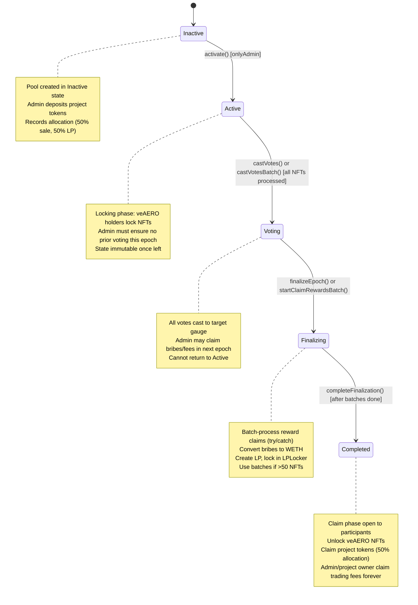

# Pool Lifecycle Flow

```mermaid
stateDiagram-v2
    [*] --> Inactive
    
    Inactive --> Active: activate() [onlyAdmin]
    
    Active --> Voting: castVotes() or castVotesBatch() [all NFTs processed]
    
    Voting --> Finalizing: finalizeEpoch() or startClaimRewardsBatch()
    
    Finalizing --> Completed: completeFinalization() [after batches done]
    
    
    note right of Inactive
        Pool created in Inactive state
        Admin deposits project tokens
        Records allocation (50% sale, 50% LP)
    end note
    
    note right of Active
        Locking phase: veAERO holders lock NFTs
        Admin must ensure no prior voting this epoch
        State immutable once left
    end note
    
    note right of Voting
        All votes cast to target gauge
        Admin may claim bribes/fees in next epoch
        Cannot return to Active
    end note
    
    note right of Finalizing
        Batch-process reward claims (try/catch)
        Convert bribes to WETH
        Create LP, lock in LPLocker
        Use batches if >50 NFTs
    end note
    
    note right of Completed
        Claim phase open to participants
        Unlock veAERO NFTs
        Claim project tokens (50% allocation)
        Admin/project owner claim trading fees forever
    end note
```
