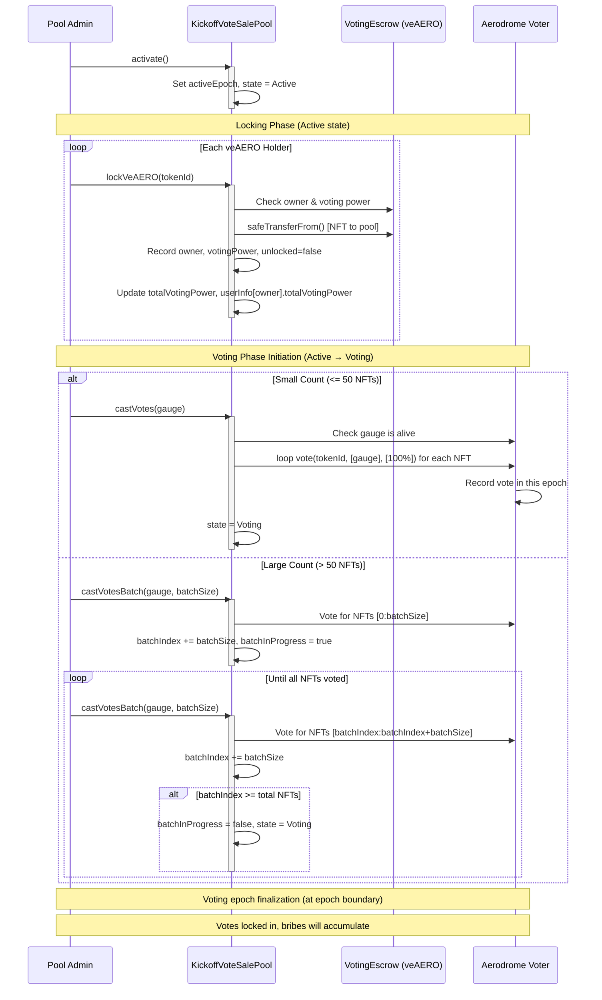

# Voting Phase Flow

```mermaid
sequenceDiagram
    participant Admin as Pool Admin
    participant Pool as KickoffVoteSalePool
    participant VE as VotingEscrow (veAERO)
    participant Voter as Aerodrome Voter

    Admin->>Pool: activate()
    activate Pool
    Pool->>Pool: Set activeEpoch, state = Active
    deactivate Pool

    Note over Admin,Voter: Locking Phase (Active state)
    loop Each veAERO Holder
        Admin->>Pool: lockVeAERO(tokenId)
        activate Pool
        Pool->>VE: Check owner & voting power
        Pool->>VE: safeTransferFrom() [NFT to pool]
        Pool->>Pool: Record owner, votingPower, unlocked=false
        Pool->>Pool: Update totalVotingPower, userInfo[owner].totalVotingPower
        deactivate Pool
    end

    Note over Admin,Voter: Voting Phase Initiation (Active → Voting)
    
    alt Small Count (<= 50 NFTs)
        Admin->>Pool: castVotes(gauge)
        activate Pool
        Pool->>Voter: Check gauge is alive
        Pool->>Voter: loop vote(tokenId, [gauge], [100%]) for each NFT
        Voter->>Voter: Record vote in this epoch
        Pool->>Pool: state = Voting
        deactivate Pool
    else Large Count (> 50 NFTs)
        Admin->>Pool: castVotesBatch(gauge, batchSize)
        activate Pool
        Pool->>Voter: Vote for NFTs [0:batchSize]
        Pool->>Pool: batchIndex += batchSize, batchInProgress = true
        deactivate Pool
        
        loop Until all NFTs voted
            Admin->>Pool: castVotesBatch(gauge, batchSize)
            activate Pool
            Pool->>Voter: Vote for NFTs [batchIndex:batchIndex+batchSize]
            Pool->>Pool: batchIndex += batchSize
            alt batchIndex >= total NFTs
                Pool->>Pool: batchInProgress = false, state = Voting
            end
            deactivate Pool
        end
    end

    Note over Admin,Voter: Voting epoch finalization (at epoch boundary)
    Note over Admin,Voter: Votes locked in, bribes will accumulate
```